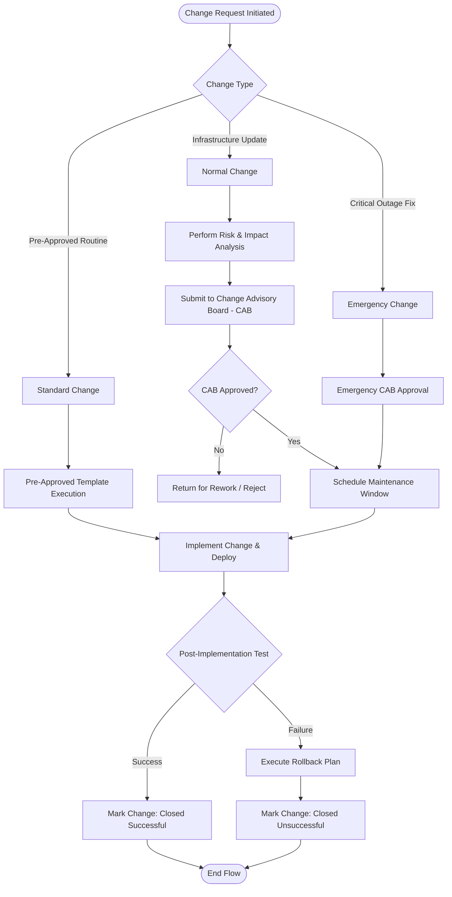

# GlowChain Change Management BPMN Workflow

Process flow for managing low-risk Standard, Normal, and Emergency changes to GlowChain CMDB infrastructure.

## Change Types & Governance
* **Standard Change**: Pre-approved routine maintenance (e.g. standard POS terminal software updates).
* **Normal Change**: Requires CAB approval and risk analysis (e.g. updating PLC line controller firmware, network switch replacements).
* **Emergency Change**: Urgent fixes requiring eCAB rapid approval (e.g. active CDN outage or store network failover).
