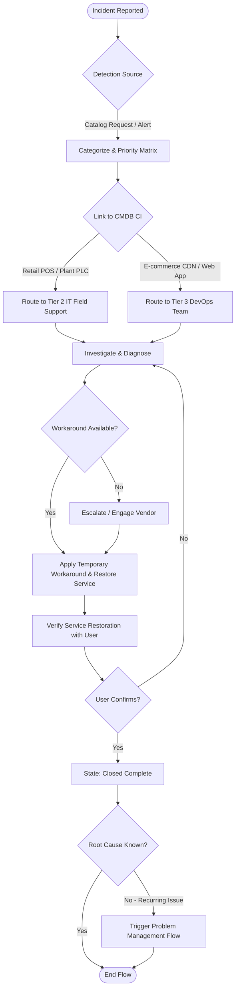

# GlowChain Incident Management BPMN Workflow

Process flow for restoring IT services (Retail POS, Manufacturing Line Controllers, E-commerce Storefront) following ITIL v4 standards.

## Key Controls & Escalation Rules
1. **CMDB Binding**: Every Incident must be linked to a target CI from `u_glowchain_*` tables (e.g. `u_glowchain_retail_pos_terminal`, `u_glowchain_manufacturing_plc_hardware`).
2. **SLA Targets**:
   - **P1 (Critical)**: Resolution within 2 hours (Plant line stoppage, Store POS outage).
   - **P2 (High)**: Resolution within 4 hours.
   - **P3/P4**: Resolution within 24–48 hours.
