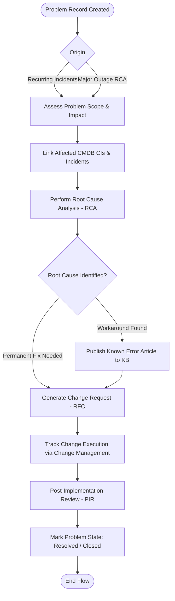

# GlowChain Problem Management BPMN Workflow

Process flow for identifying and eliminating root causes of recurring incidents across GlowChain infrastructure.

## Key Controls
1. **Known Error Database**: Workarounds published directly to ServiceNow Knowledge Base.
2. **Change Integration**: Structural changes to CIs (e.g. firmware update on PLC controllers, network router replacements) require an RFC tied to the Problem record.
